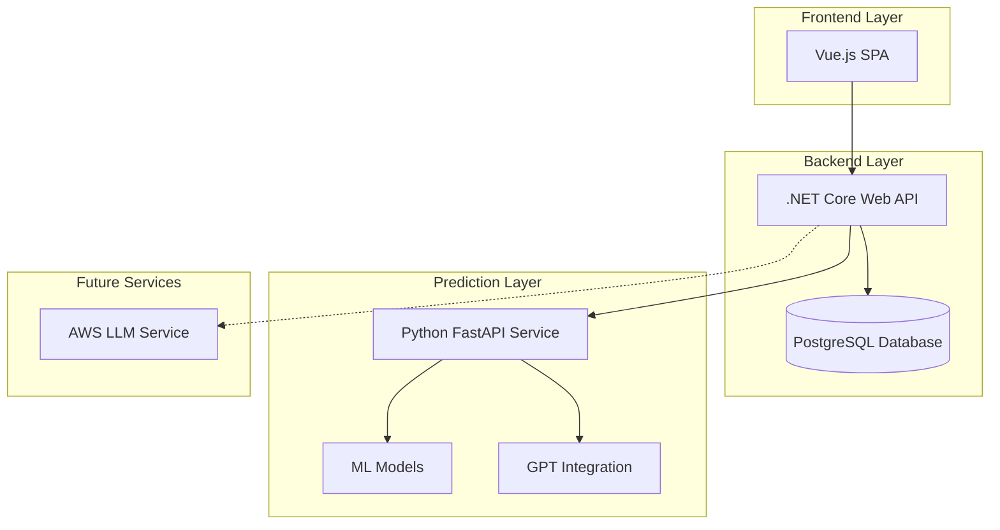

# Design Document

## Overview

PredictLottoNZ is a full-stack web application designed to analyze historical lottery data and generate predictions using multiple algorithmic approaches. The system employs a microservices architecture with three main components: a Vue.js single-page application frontend, a .NET Core Web API backend with PostgreSQL database, and a Python FastAPI prediction service. The architecture supports pluggable prediction providers, enabling seamless integration of frequency-based algorithms, machine learning models, and future AI services.

## Architecture

### System Architecture



### Service Communication

- **Frontend to Backend**: RESTful HTTP API calls with JSON payloads
- **Backend to Database**: Entity Framework Core with async/await patterns
- **Backend to Prediction Services**: HTTP client with fallback chain (AWS → FastAPI → Frequency)
- **File Processing**: Multipart form data uploads with progress tracking

## Components and Interfaces

### Frontend Components (Vue.js)

#### Core Components
- **FileUpload.vue**: Handles CSV/TXT/PDF file uploads with progress tracking
- **PredictionsView.vue**: Displays generated predictions in tabular format
- **SideMenu.vue**: Navigation and toast notification management
- **LatestDraw.vue**: Shows most recent lottery draw information

#### State Management
- **Vuex/Pinia Store**: Centralized state for upload progress, predictions, and draw data
- **API Service Layer**: Axios-based HTTP client with interceptors for error handling

### Backend Services (.NET Core)

#### Service Interfaces
```csharp
public interface ICombinationsService
{
    Task<ImportResult> UploadAsync(IFormFile file);
    Task<IEnumerable<PredictionResult>> GetPredictionsAsync(int count);
}

public interface ILottoImportService
{
    Task<ImportResult> ImportAsync(Stream csvStream);
}

public interface ILottoQueryService
{
    Task<LottoDrawDto> GetLatestDrawAsync();
    Task<bool> DrawExistsAsync(int drawNumber);
}

public interface IPredictionProvider
{
    Task<PredictionResult> PredictAsync(IEnumerable<int[]> history, int count);
    string ProviderName { get; }
}
```

#### Controller Architecture
- **Thin Controllers**: All business logic delegated to corresponding services
- **Consistent Naming**: Controller methods map directly to service methods
- **Dependency Injection**: Services injected via constructor injection
- **Async Operations**: All I/O operations use async/await patterns

### Database Schema

#### Core Entities
```csharp
[Table("LottoDraws")]
public class LottoDraw
{
    [Key] public int Draw { get; set; }
    public DateTime Date { get; set; }
    public int WinningNumber1 { get; set; }
    public int WinningNumber2 { get; set; }
    public int WinningNumber3 { get; set; }
    public int WinningNumber4 { get; set; }
    public int WinningNumber5 { get; set; }
    public int WinningNumber6 { get; set; }
    public int BonusNumber { get; set; }
    public int Powerball { get; set; }
    public string FromLast { get; set; }
    // Additional statistical and prize fields...
}

[Table("NumberCombinations")]
public class NumberCombination
{
    public int Id { get; set; }
    public int Number1 { get; set; }
    public int Number2 { get; set; }
    public int Number3 { get; set; }
    public int Number4 { get; set; }
    public int Number5 { get; set; }
    public int Number6 { get; set; }
    public DateTime CreatedAt { get; set; }
}

[Table("Predictions")]
public class Prediction
{
    public int Id { get; set; }
    public DateTime CreatedAt { get; set; }
    public string Source { get; set; }
    public int Number1 { get; set; }
    public int Number2 { get; set; }
    public int Number3 { get; set; }
    public int Number4 { get; set; }
    public int Number5 { get; set; }
    public int Number6 { get; set; }
    public string RawRequestPayload { get; set; }
    public string RawResponsePayload { get; set; }
}
```

## Data Models

### Request/Response Models

#### Import Models
```csharp
public class ImportResult
{
    public int RecordsAdded { get; set; }
    public int RecordsSkipped { get; set; }
}

public class LottoDrawDto
{
    public int Draw { get; set; }
    public DateTime Date { get; set; }
    public int[] WinningNumbers { get; set; }
    public int BonusNumber { get; set; }
    public int Powerball { get; set; }
}
```

#### Prediction Models
```csharp
public class PredictionResult
{
    public int[] Numbers { get; set; }
    public double Score { get; set; }
    public string Source { get; set; }
}

public class PredictionRequest
{
    public int Count { get; set; }
    public string ProviderPreference { get; set; }
}
```

### Python FastAPI Models
```python
class PredictRequest(BaseModel):
    weekly_numbers: List[float] = Field(..., example=[5, 12, 18, 20, 33, 40])

class PredictResponse(BaseModel):
    ml_prediction: float
    gpt_prediction: float
    blended_prediction: float
```

## Data Models

### File Processing Pipeline

#### CSV Header Mapping
- **Space Removal**: "Winning Number 1" → "WinningNumber1"
- **Interval Mapping**: "1-Oct" → "OneToTen", "Nov-20" → "ElevenToTwenty"
- **Type Conversion**: Automatic parsing to int, decimal, DateTime, string types
- **Error Handling**: Invalid rows logged and skipped, processing continues

#### Duplicate Detection Strategy
- **Primary Key**: Draw number used as unique identifier
- **Batch Processing**: Check existing draws before insertion
- **Conflict Resolution**: Skip duplicates, insert only new records
- **Reporting**: Track skipped vs added counts in ImportResult

## Correctness Properties

*A property is a characteristic or behavior that should hold true across all valid executions of a system-essentially, a formal statement about what the system should do. Properties serve as the bridge between human-readable specifications and machine-verifiable correctness guarantees.*

### Property Reflection

After reviewing all properties identified in the prework, several can be consolidated to eliminate redundancy:

- Properties 1.4 and 4.4 both test error handling during batch processing - these can be combined into a comprehensive batch processing property
- Properties 5.4, 6.4, and 10.1 all test prediction storage - these can be consolidated into a single prediction persistence property
- Properties 7.3 and 7.4 both test upload completion feedback - these can be combined into upload feedback property
- Properties 10.2 and 10.3 both test data preservation - these can be combined into data preservation property

### Core Properties

**Property 1: CSV parsing extracts valid data**
*For any* valid Powerball NZ CSV file, parsing should extract all lottery draw data with correct field mappings and type conversions
**Validates: Requirements 1.1, 1.2**

**Property 2: Duplicate detection preserves data integrity**
*For any* CSV import containing duplicate draw numbers, the system should skip existing records and process only new ones, maintaining accurate counts
**Validates: Requirements 1.3, 1.4, 2.2**

**Property 3: Error handling maintains processing continuity**
*For any* file containing mixed valid and invalid data, the system should skip invalid records, log errors, and continue processing valid records
**Validates: Requirements 1.5, 4.4**

**Property 4: Draw existence queries are accurate**
*For any* draw number query, the system should return the correct existence status based on current database state
**Validates: Requirements 2.1**

**Property 5: Latest draw retrieval is consistent**
*For any* database state containing draws, querying for the latest draw should return the record with the most recent date
**Validates: Requirements 3.1, 3.2**

**Property 6: Number combination validation enforces constraints**
*For any* uploaded number combination, the system should validate exactly 6 unique integers in range [1, 40] and reject invalid combinations
**Validates: Requirements 4.2**

**Property 7: File format parsing is universal**
*For any* supported file format (CSV, TXT, PDF), the parser should extract 6-number combinations regardless of format
**Validates: Requirements 4.1**

**Property 8: Frequency calculation is deterministic**
*For any* set of historical combinations, frequency scores should be calculated consistently and ranking should be deterministic
**Validates: Requirements 5.1, 5.2, 5.3**

**Property 9: Prediction provider fallback chain works reliably**
*For any* prediction request, the system should attempt providers in order (AWS LLM → FastAPI → Frequency) and fallback when services are unavailable
**Validates: Requirements 6.1, 6.2**

**Property 10: FastAPI integration maintains data contract**
*For any* call to the FastAPI service, the system should send weekly number data and receive ML, GPT, and blended predictions in the expected format
**Validates: Requirements 6.3**

**Property 11: Prediction persistence is comprehensive**
*For any* generated prediction from any provider, the system should store the prediction with source identification, timestamp, and all associated data
**Validates: Requirements 5.4, 6.4, 10.1, 10.4**

**Property 12: Upload progress tracking is accurate**
*For any* file upload, the system should provide accurate progress updates from 0 to 100 percent and appropriate completion feedback
**Validates: Requirements 7.1, 7.2, 7.3, 7.4**

**Property 13: Prediction display includes required information**
*For any* prediction result, the display should include combination index, all six numbers, and prediction source
**Validates: Requirements 8.2**

**Property 14: Toast notifications respond to events**
*For any* import event (success or failure), the system should display appropriate toast notifications with relevant details
**Validates: Requirements 8.4**

**Property 15: Configuration uses environment variables**
*For any* service configuration, the system should read database credentials and external service URLs from environment variables
**Validates: Requirements 9.2**

**Property 16: Database initialization is complete**
*For any* PostgreSQL service startup, the system should create the required database schema with all migrations applied
**Validates: Requirements 9.3**

**Property 17: Data preservation maintains historical integrity**
*For any* imported lottery data or uploaded combinations, the system should preserve all original information with accurate timestamps
**Validates: Requirements 10.2, 10.3**

**Property 18: Combination storage includes metadata**
*For any* stored number combination, the record should include creation timestamp and be saved to the NumberCombination table
**Validates: Requirements 4.3**

## Error Handling

### File Processing Errors
- **Invalid File Formats**: Return 400 Bad Request with specific format requirements
- **Corrupted Files**: Log parsing errors, skip corrupted sections, continue with valid data
- **Size Limits**: Enforce maximum file size limits with clear error messages
- **Empty Files**: Handle gracefully with appropriate user feedback

### Database Errors
- **Connection Failures**: Implement retry logic with exponential backoff
- **Constraint Violations**: Handle duplicate key errors gracefully during batch inserts
- **Transaction Failures**: Rollback incomplete operations, maintain data consistency
- **Migration Errors**: Provide clear error messages for schema update failures

### External Service Errors
- **Network Timeouts**: Implement circuit breaker pattern for external service calls
- **Service Unavailable**: Graceful fallback to next provider in chain
- **Invalid Responses**: Validate external service responses, handle malformed data
- **Authentication Failures**: Secure handling of API keys and credentials

### Validation Errors
- **Number Range Violations**: Clear error messages for out-of-range numbers
- **Combination Constraints**: Specific feedback for invalid combination formats
- **Required Field Validation**: Field-level error messages for missing data
- **Type Conversion Errors**: Handle invalid data types with appropriate fallbacks

## Testing Strategy

### Dual Testing Approach

The system will employ both unit testing and property-based testing to ensure comprehensive coverage:

- **Unit tests** verify specific examples, edge cases, and error conditions
- **Property tests** verify universal properties that should hold across all inputs
- Together they provide comprehensive coverage: unit tests catch concrete bugs, property tests verify general correctness

### Unit Testing Requirements

Unit tests will focus on:
- Specific examples that demonstrate correct behavior
- Integration points between components
- Edge cases like empty databases, network failures, and invalid inputs
- Error handling scenarios with specific input/output pairs

### Property-Based Testing Requirements

Property-based testing will use **fast-check** for JavaScript/TypeScript components and **FsCheck** for .NET components:

- Each property-based test will run a minimum of 100 iterations
- Each property-based test will be tagged with a comment explicitly referencing the correctness property: `**Feature: predict-lotto-nz, Property {number}: {property_text}**`
- Each correctness property will be implemented by a single property-based test
- Property tests will use smart generators that constrain to valid input spaces

### Test Coverage Areas

#### CSV Processing Tests
- Header mapping transformations
- Duplicate detection logic
- Error handling with mixed valid/invalid data
- Batch processing with various file sizes

#### Prediction Algorithm Tests
- Frequency calculation accuracy
- Ranking and scoring consistency
- Provider fallback chain behavior
- External service integration

#### Database Operation Tests
- CRUD operations for all entities
- Migration and schema validation
- Concurrent access scenarios
- Data integrity constraints

#### API Integration Tests
- Request/response validation
- Error handling and status codes
- File upload with progress tracking
- Authentication and authorization

### Testing Infrastructure

- **Test Database**: Isolated PostgreSQL instance for testing
- **Mock Services**: Configurable mocks for external prediction services
- **Test Data Generation**: Automated generation of valid/invalid test data
- **Performance Testing**: Load testing for file processing and prediction generation